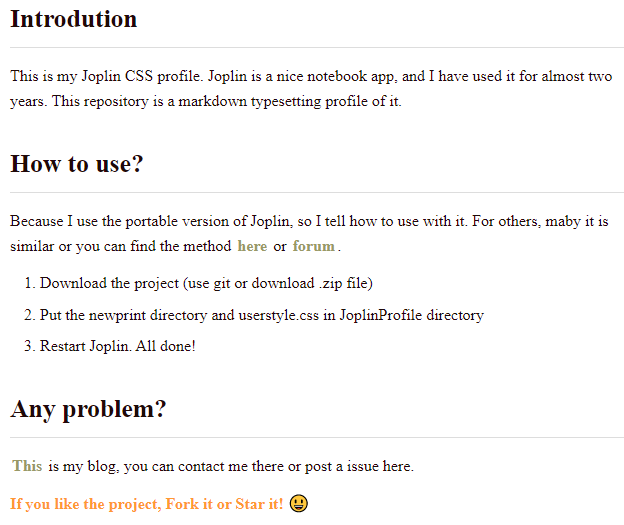

## Introduction

[download](https://github.com/lightzhan/joplin-theme-gloden-2020/archive/master.zip)

This is my Joplin CSS profile. Joplin is a nice notebook app, and I have used it for almost two years. This repository is a markdown typesetting profile of it.

## How to use?

Because I use the portable version of Joplin, so I tell how to use with it. For others, maybe it is similar or you can find the method [here](https://joplinapp.org/) or [forum](https://discourse.joplinapp.org/).
1. Download the project (use git or download .zip file)
2. Put the  newprint directory and userstyle.css in JoplinProfile directory
3. Restart Joplin. All done!

## Any problem?
[This](https://lightzhan.github.io/) is my blog, you can contact me there or post a issue here.

**If you like the project, Don't forget to Fork it or Star it!** :)
